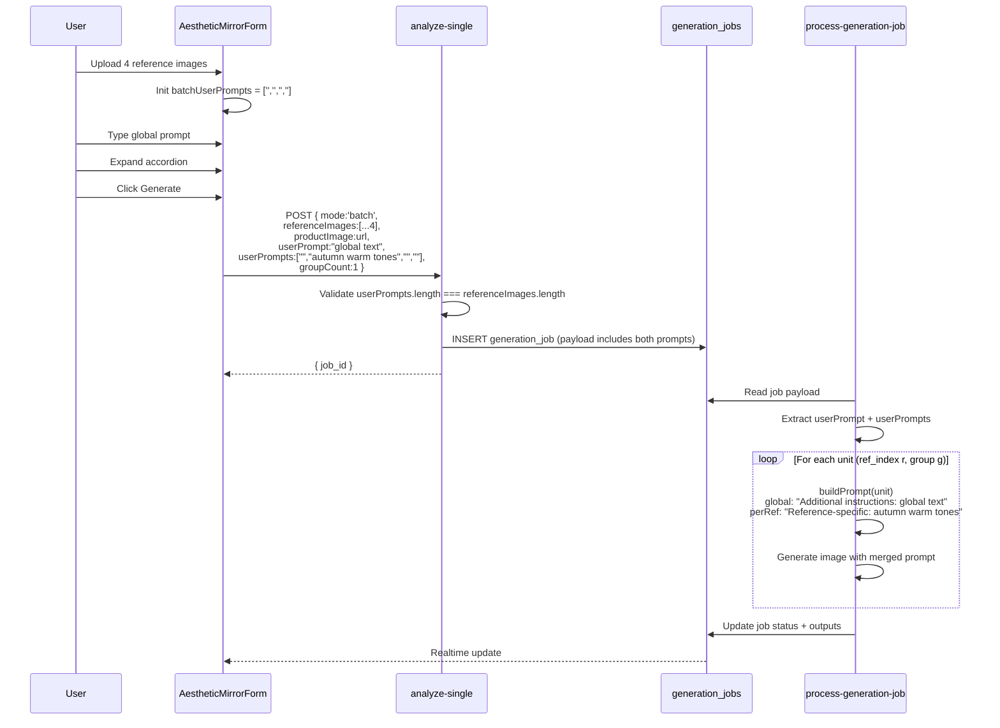

# Design Document: Per-Reference-Image Prompts in Batch Mode

**Date**: 2026-03-02
**Status**: Proposed
**Complexity Level**: Medium
**Complexity Rationale**: (1) Requires coordinated changes across frontend state, API contract, and backend prompt pipeline; 8 acceptance criteria across 6 files. (2) No new async coordination or complex state machines, but array-index alignment across 3 layers introduces data integrity risk.

---

## Agreement Checklist

- **Scope**: Add per-reference-image prompt support to batch mode in Style Replication (Aesthetic Mirror)
- **Non-scope**: Single mode and refinement mode are unchanged; no changes to credit calculation, job queue, or generation pipeline logic
- **Constraints**: Backward compatible -- `userPrompts` is optional; old clients sending only `userPrompt` must continue to work identically
- **Performance requirements**: No additional API calls; prompt merging is string concatenation only
- **UI decision**: Accordion/collapsible panels with reference image thumbnails (user-confirmed)
- **Prompt structure**: Global prompt (applies to all) + independent per-reference prompts (user-confirmed)

Reflection:
- [x] Scope is reflected in Sections: Frontend Changes, API Contract Changes, Backend Changes, i18n Changes
- [x] Non-scope confirmed: single/refinement modes untouched in all change descriptions
- [x] Backward compatibility ensured: `userPrompts` is optional at every layer
- [x] No performance measurement required -- pure string operations

---

## Applicable Standards

| Standard | Type | Source |
|----------|------|--------|
| shadcn/ui + Radix primitives for all UI components | `[explicit]` | package.json dependencies, components/ui/ directory |
| next-intl for i18n with `useTranslations` hook | `[explicit]` | All studio components use `useTranslations` |
| Tailwind CSS for styling with project color palette (#d0d4dc borders, #f1f3f6 backgrounds, etc.) | `[implicit]` | Observed in AestheticMirrorForm.tsx |
| Edge functions use Deno.serve + shared http.ts helpers (ok/err/options) | `[explicit]` | All edge functions follow this pattern |
| Payload stored in generation_jobs.payload as JSON; worker reads from payload | `[implicit]` | analyze-single and process-generation-job pattern |
| Frontend API types defined in lib/api/edge-functions.ts with explicit interfaces | `[implicit]` | AnalyzeSingleParams interface pattern |
| Accordion not currently in project -- @radix-ui/react-accordion not installed | `[explicit]` | package.json audit |

---

## Prerequisite ADRs

No existing common ADRs found in the project. No new common ADR required for this change -- it is a localized feature addition with no cross-cutting architectural concerns.

---

## Existing Codebase Analysis

### Implementation Path Mapping

| File | Exists | Purpose in This Change |
|------|--------|----------------------|
| `components/studio/AestheticMirrorForm.tsx` | Yes (610 lines) | Add `batchUserPrompts` state, accordion UI, submission logic |
| `lib/api/edge-functions.ts` | Yes (347 lines) | Add `userPrompts?: string[]` to `AnalyzeSingleParams` |
| `supabase/functions/analyze-single/index.ts` | Yes (163 lines) | Validate `userPrompts` field in batch mode |
| `supabase/functions/process-generation-job/index.ts` | Yes (1612 lines) | Merge per-ref prompt in `buildPrompt()` |
| `messages/en.json` | Yes | Add i18n keys under `studio.aestheticMirror` |
| `messages/zh.json` | Yes | Add i18n keys under `studio.aestheticMirror` |
| `components/ui/collapsible.tsx` | New | Custom collapsible component (no accordion dependency) |

### Similar Functionality Search

**Search keywords**: `userPrompts`, `batchUserPrompts`, `per-reference`, `perRef`, `accordion`, `collapsible`

**Result**: No similar per-item prompt functionality exists anywhere in the codebase. The closest pattern is the single `userPrompt` string used in all three modes (single/batch/refinement). No duplicate implementation risk.

**Decision**: New implementation following existing patterns.

### Existing Interface Investigation

**`AestheticMirrorForm` key state variables (batch-relevant)**:
- `batchRefs: UImg[]` -- array of batch reference images (max 12)
- `batchProduct: UImg | null` -- single product image for batch mode
- `userPrompt: string` -- global supplementary prompt
- `mode: Mode` -- 'single' | 'batch'
- `groupCount: number` -- groups per reference (1-9)

**`buildPrompt()` in process-generation-job** (line 1271-1318):
- Receives `unit: StyleReplicateUnit` with `reference_index`
- Appends `userPrompt` as `Additional instructions: ${userPrompt}` (line 1301, 1315)
- Called once per unit in `runWithConcurrency` loop (line 1361)

**Call sites for `analyzeSingle`**:
- `components/studio/AestheticMirrorForm.tsx` line 156, 202, 214 (handleSubmit + retryFailed)

### Code Inspection Evidence

| File | Key Function/Section | Relevance |
|------|---------------------|-----------|
| `AestheticMirrorForm.tsx:86` | `useState('')` for userPrompt | Integration point -- add parallel state |
| `AestheticMirrorForm.tsx:202` | `handleSubmit` batch branch | Integration point -- add userPrompts to request |
| `AestheticMirrorForm.tsx:264` | `addBatchRefs` | Integration point -- sync batchUserPrompts length |
| `AestheticMirrorForm.tsx:336` | `setBatchRefs((p) => p.filter(...))` onRemove | Integration point -- sync batchUserPrompts on remove |
| `AestheticMirrorForm.tsx:418-426` | Prompt section UI | Integration point -- add accordion below Textarea |
| `edge-functions.ts:286-304` | `AnalyzeSingleParams` interface | Integration point -- add userPrompts field |
| `analyze-single/index.ts:44-57` | Batch mode validation | Integration point -- validate userPrompts |
| `analyze-single/index.ts:98-105` | Payload construction | Pattern reference -- userPrompts flows through payload |
| `process-generation-job/index.ts:1135` | `userPrompt` extraction from payload | Integration point -- extract userPrompts |
| `process-generation-job/index.ts:1271-1318` | `buildPrompt()` | Integration point -- merge per-ref prompt |
| `process-generation-job/index.ts:1091-1099` | Batch unit loop with `reference_index: r` | Pattern reference -- r maps to userPrompts[r] |
| `components/shared/ImageThumbnail.tsx` | Reusable thumbnail component | Pattern reference -- reuse for accordion headers |

---

## Data Representation Decision

### New Field: `userPrompts: string[]`

**Reuse-vs-New Assessment**:
- **Semantic fit**: Existing `userPrompt: string` is a single global prompt. Per-reference prompts are fundamentally an array, not a single value. No overlap.
- **Responsibility fit**: `userPrompt` applies to all references; `userPrompts[i]` applies to reference `i` only. Different responsibilities.
- **Lifecycle fit**: `userPrompts` must be synced with `batchRefs` array length -- different lifecycle from `userPrompt`.
- **Boundary/interop cost**: Both fields coexist in the same payload, no conversion needed.

**Decision**: New structure justified (3 criteria fail). `userPrompts` is a separate `string[]` field at every layer.

---

## Architecture Overview

```mermaid
flowchart TD
    subgraph Frontend ["Frontend (AestheticMirrorForm)"]
        UP[userPrompt: string<br/>Global prompt]
        BUP[batchUserPrompts: string[]<br/>Per-reference prompts]
        ACC[Accordion UI<br/>Per-ref prompt panels]
    end

    subgraph API ["API Contract"]
        REQ[analyze-single request<br/>userPrompt?: string<br/>userPrompts?: string[]]
    end

    subgraph Backend ["Backend (process-generation-job)"]
        BP[buildPrompt per unit<br/>global + perRef merge]
    end

    UP --> REQ
    BUP --> REQ
    ACC --> BUP
    REQ --> BP
```

## Data Flow



---

## Detailed Design

### 1. Frontend Changes (`AestheticMirrorForm.tsx`)

#### 1.1 New State

```typescript
const [batchUserPrompts, setBatchUserPrompts] = useState<string[]>([])
```

#### 1.2 Array Sync Logic

When `batchRefs` changes, `batchUserPrompts` must stay in sync:

```typescript
// In addBatchRefs handler (line 264):
const addBatchRefs = (files: FileList | null) => {
  setBatchRefs((prev) => {
    const newFiles = Array.from(files ?? [])
      .filter((f) => f.type.startsWith('image/'))
      .slice(0, Math.max(0, 12 - prev.length))
      .map((file) => ({ file, previewUrl: URL.createObjectURL(file) }))
    // Sync per-ref prompts
    setBatchUserPrompts((pp) => [...pp, ...newFiles.map(() => '')])
    return [...prev, ...newFiles]
  })
}

// In batchRefs onRemove handler (line 336):
onRemove={() => {
  setBatchRefs((p) => p.filter((_, idx) => idx !== i))
  setBatchUserPrompts((p) => p.filter((_, idx) => idx !== i))
}}
```

#### 1.3 Accordion UI (Custom Collapsible -- No New Dependency)

Instead of adding `@radix-ui/react-accordion` (not installed), use a simple custom collapsible built with React state and Tailwind transitions. This follows the project's pattern of minimal dependencies.

The accordion section is rendered **below** the global prompt Textarea, only when `mode === 'batch' && batchRefs.length > 1`:

```typescript
{mode === 'batch' && batchRefs.length > 1 && (
  <div className="mt-3 space-y-2">
    <Label className="text-[13px] font-medium text-[#5a5e6b]">
      {t('perRefPromptTitle')}
    </Label>
    {batchRefs.map((ref, i) => (
      <PerRefPromptPanel
        key={ref.previewUrl}
        index={i}
        thumbnail={ref.previewUrl}
        filename={ref.file.name}
        value={batchUserPrompts[i] ?? ''}
        onChange={(v) => setBatchUserPrompts((p) => {
          const next = [...p]
          next[i] = v
          return next
        })}
        defaultOpen={batchRefs.length === 2}
        disabled={isRunning}
      />
    ))}
  </div>
)}
```

`PerRefPromptPanel` is a local component within the same file (not extracted to a separate file -- it has no reuse outside this form):

```typescript
function PerRefPromptPanel({
  index, thumbnail, filename, value, onChange, defaultOpen, disabled
}: {
  index: number
  thumbnail: string
  filename: string
  value: string
  onChange: (v: string) => void
  defaultOpen: boolean
  disabled: boolean
}) {
  const [open, setOpen] = useState(defaultOpen)
  const t = useTranslations('studio.aestheticMirror')
  return (
    <div className="rounded-xl border border-[#d0d4dc] bg-[#f7f8fa]">
      <button
        type="button"
        className="flex w-full items-center gap-2.5 px-3 py-2"
        onClick={() => setOpen((o) => !o)}
        disabled={disabled}
      >
        
        <span className="flex-1 truncate text-left text-[13px] text-[#3f4047]">
          {t('perRefLabel', { index: index + 1, name: filename })}
        </span>
        <ChevronDown className={`h-4 w-4 text-[#848791] transition-transform
          ${open ? 'rotate-180' : ''}`} />
      </button>
      {open && (
        <div className="px-3 pb-3">
          <Textarea
            value={value}
            onChange={(e) => onChange(e.target.value)}
            rows={2}
            className="min-h-[72px] rounded-xl border-[#d0d4dc] bg-white text-[13px]
              placeholder:text-[#9599a3]"
            placeholder={t('perRefPlaceholder')}
            disabled={disabled}
          />
        </div>
      )}
    </div>
  )
}
```

Note: `ChevronDown` is already available from `lucide-react` and must be added to the import list.

#### 1.4 Submission Logic

In `handleSubmit` (line 198-202), add `userPrompts` to the batch request:

```typescript
// Existing line 202:
await runRequest({
  mode: 'batch',
  referenceImages: refUrls,
  productImage: product.publicUrl,
  groupCount,
  model,
  aspectRatio,
  imageSize,
  userPrompt: userPrompt.trim() || undefined,
  // NEW: per-reference prompts (only if any non-empty)
  userPrompts: batchUserPrompts.some((p) => p.trim())
    ? batchUserPrompts.map((p) => p.trim())
    : undefined,
}, refUrls.length * groupCount)
```

The `retryFailed` callback (line 208-215) does not need changes -- it reuses the job payload already stored in the database which includes `userPrompts`.

#### 1.5 handleSubmit Dependency Array

Add `batchUserPrompts` to the `useCallback` dependency array (line 206).

### 2. API Type Changes (`lib/api/edge-functions.ts`)

Add `userPrompts` to `AnalyzeSingleParams`:

```typescript
export interface AnalyzeSingleParams {
  // ... existing fields ...
  userPrompt?: string
  userPrompts?: string[]  // NEW: per-reference prompts, length must match referenceImages
  // ... rest ...
}
```

### 3. Backend: Validation (`analyze-single/index.ts`)

Add validation inside the `mode === "batch"` block (after line 57):

```typescript
// After existing batch validation (line 44-57):
if (body.userPrompts !== undefined) {
  if (!Array.isArray(body.userPrompts)) {
    return err("BATCH_INPUT_INVALID", "userPrompts must be an array if provided");
  }
  if (body.userPrompts.length !== (body.referenceImages as string[]).length) {
    return err("BATCH_INPUT_INVALID",
      "userPrompts length must match referenceImages length");
  }
  if (body.userPrompts.some((x: unknown) => typeof x !== "string")) {
    return err("BATCH_INPUT_INVALID", "each userPrompts entry must be a string");
  }
}
```

No changes to payload construction -- `body.userPrompts` flows through via the existing spread (`{ ...body, mode, groupCount, ... }`).

### 4. Backend: Prompt Merging (`process-generation-job/index.ts`)

#### 4.1 Extract `userPrompts` from payload

After line 1135:

```typescript
const userPrompt = typeof payload.userPrompt === "string"
  ? payload.userPrompt.trim() : "";
// NEW:
const userPrompts: string[] = Array.isArray(payload.userPrompts)
  ? (payload.userPrompts as string[]).map((s) =>
      typeof s === "string" ? s.trim() : "")
  : [];
```

#### 4.2 Modify `buildPrompt()`

The `buildPrompt` function (line 1271) receives `unit` which has `reference_index`. Use it to look up the per-reference prompt:

```typescript
const buildPrompt = (
  unit: StyleReplicateUnit,
  analysisPrompt?: string,
  refinementAnalysisPrompt?: string,
): string => {
  // Refinement mode: unchanged
  if (unit.mode === "refinement") { /* ... existing logic ... */ }

  // Compute the merged user instruction
  const perRefPrompt = userPrompts[unit.reference_index]?.trim() ?? "";
  const mergedUserInstruction = [userPrompt, perRefPrompt]
    .filter(Boolean)
    .join(". ");

  if (analysisPrompt) {
    const parts = [
      analysisPrompt,
      "Image 1 is the reference style image only -- do not copy its products or subjects.",
      "Image 2 contains the product to preserve -- maintain its exact shape, material, color, texture, logo, and all key design details.",
      "Do not simply return Image 2 unchanged or make only a minimal edit.",
      `Output aspect ratio: ${aspectRatio}, size: ${requestSize}.`,
    ];
    if (mergedUserInstruction) {
      parts.push(`Additional instructions: ${mergedUserInstruction}`);
    }
    return parts.join(" ");
  }

  // Fallback single-stage prompt
  const promptParts = [
    "Image 1 is style reference only. Image 2 contains the product to preserve.",
    "Create a brand-new high-quality e-commerce image: ...",
    // ... existing lines ...
    `Output aspect ratio: ${aspectRatio}, size: ${requestSize}.`,
  ];
  if (mergedUserInstruction) {
    promptParts.push(`Additional instructions: ${mergedUserInstruction}`);
  }
  return promptParts.join(" ");
};
```

**Merge format**: `"{global}. {perRef}"` -- simple sentence concatenation. When only global or only per-ref exists, no trailing/leading period.

### 5. i18n Changes

#### `messages/en.json` (under `studio.aestheticMirror`):

```json
"perRefPromptTitle": "Per-Reference Prompts",
"perRefLabel": "#{index} {name}",
"perRefPlaceholder": "Specific instructions for this reference image..."
```

#### `messages/zh.json` (under `studio.aestheticMirror`):

```json
"perRefPromptTitle": "单图提示词",
"perRefLabel": "#{index} {name}",
"perRefPlaceholder": "针对此参考图的特定指令..."
```

---

## Integration Point Map

```yaml
Integration Point 1:
  Existing Component: AestheticMirrorForm.tsx - addBatchRefs()
  Integration Method: State sync -- append empty strings to batchUserPrompts
  Impact Level: Medium (Data Usage)
  Required Test Coverage: Verify batchUserPrompts.length always equals batchRefs.length after add

Integration Point 2:
  Existing Component: AestheticMirrorForm.tsx - batchRefs onRemove handler
  Integration Method: State sync -- filter batchUserPrompts at same index
  Impact Level: Medium (Data Usage)
  Required Test Coverage: Verify correct prompt removed when middle image removed

Integration Point 3:
  Existing Component: AestheticMirrorForm.tsx - handleSubmit batch branch (line 202)
  Integration Method: Add userPrompts field to request object
  Impact Level: Medium (Data Usage)
  Required Test Coverage: Verify userPrompts sent only when non-empty values exist

Integration Point 4:
  Existing Component: lib/api/edge-functions.ts - AnalyzeSingleParams
  Integration Method: Add optional field
  Impact Level: Low (Type Extension)
  Required Test Coverage: TypeScript compilation

Integration Point 5:
  Existing Component: analyze-single/index.ts - batch mode validation block
  Integration Method: Add validation after existing checks
  Impact Level: Medium (Process Flow Extension)
  Required Test Coverage: Invalid userPrompts rejected; missing userPrompts accepted

Integration Point 6:
  Existing Component: process-generation-job/index.ts - buildPrompt()
  Integration Method: Replace direct userPrompt usage with merged instruction
  Impact Level: High (Process Flow Change)
  Required Test Coverage: All 4 combinations tested (global only, per-ref only, both, neither)
```

---

## Integration Boundary Contracts

```yaml
Boundary: Frontend -> analyze-single API
  Input:
    userPrompt?: string (global, optional)
    userPrompts?: string[] (per-reference, optional)
    - If provided, length MUST equal referenceImages.length
    - Each element is a string (may be empty "")
  Output (sync): { job_id: string, status: "processing" }
  On Error:
    - BATCH_INPUT_INVALID if userPrompts length mismatch or non-string elements
    - Existing errors unchanged

Boundary: analyze-single -> generation_jobs.payload
  Input: Full request body spread into payload JSON column
  Output (sync): Stored in DB; worker reads payload.userPrompts
  On Error: N/A (DB insert failure handled by existing error path)

Boundary: process-generation-job buildPrompt() internal
  Input:
    - userPrompt: string (from payload.userPrompt, trimmed)
    - userPrompts: string[] (from payload.userPrompts, each trimmed)
    - unit.reference_index: number (index into userPrompts)
  Output (sync): Merged prompt string
  On Error: If userPrompts[reference_index] is undefined/empty, falls back to global-only behavior
```

---

## Field Propagation Map

| Field | Frontend State | API Request | DB Payload | Worker Extract | buildPrompt |
|-------|---------------|-------------|------------|---------------|-------------|
| `userPrompt` (global) | `userPrompt: string` | `userPrompt?: string` | `payload.userPrompt` | `const userPrompt = ...trim()` | Merged into "Additional instructions" | preserved |
| `userPrompts` (per-ref) | `batchUserPrompts: string[]` | `userPrompts?: string[]` | `payload.userPrompts` | `const userPrompts: string[] = ...map(trim)` | `userPrompts[unit.reference_index]` merged | preserved |

Both fields are **preserved** (not transformed) at each boundary. Trimming at extraction is cosmetic, not semantic.

---

## Change Impact Map

```yaml
Change Target: AestheticMirrorForm - batch mode UI and submission
Direct Impact:
  - components/studio/AestheticMirrorForm.tsx (new state, UI section, submission logic)
  - lib/api/edge-functions.ts (AnalyzeSingleParams type extension)
Indirect Impact:
  - supabase/functions/analyze-single/index.ts (validation addition)
  - supabase/functions/process-generation-job/index.ts (buildPrompt merge logic)
  - messages/en.json (3 new keys)
  - messages/zh.json (3 new keys)
No Ripple Effect:
  - Single mode -- no changes (batchUserPrompts only used in batch branch)
  - Refinement mode -- no changes (buildPrompt refinement branch untouched)
  - Credit calculation -- no changes (userPrompts has no cost impact)
  - Job queue system -- no changes (payload is opaque JSON)
  - History page -- no changes (displays job results, not prompts)
  - Pricing system -- no changes
  - Auth system -- no changes
```

---

## Interface Change Impact Analysis

| Existing Operation | New Operation | Conversion Required | Adapter Required | Compatibility Method |
|-------------------|---------------|---------------------|------------------|---------------------|
| `analyzeSingle({ userPrompt })` | `analyzeSingle({ userPrompt, userPrompts })` | None | Not Required | `userPrompts` is optional |
| `AnalyzeSingleParams.userPrompt` | `AnalyzeSingleParams.userPrompt + userPrompts` | None | Not Required | Additive field |
| `buildPrompt(unit)` uses `userPrompt` directly | `buildPrompt(unit)` merges `userPrompt + userPrompts[ref_index]` | Yes (internal) | Not Required | Merge logic replaces direct usage |
| analyze-single batch validation | analyze-single batch validation + userPrompts check | None | Not Required | New validation is additive |

---

## Implementation Approach

**Selected Strategy**: Vertical Slice

**Rationale**: This feature has minimal external dependencies, a clear user-facing value at completion, and changes span all layers (UI -> API type -> validation -> worker). A vertical slice allows the entire feature to be verified end-to-end as a single unit. There is no shared foundation to build first -- each layer change is specific to this feature.

**Integration Point**: The feature becomes operational when all 6 files are modified and the edge functions are deployed. There is no intermediate usable state.

**Verification**: L1 (Functional Operation) -- the feature is verified by uploading multiple reference images in batch mode, entering per-reference prompts, and confirming the generated images reflect reference-specific instructions.

### Implementation Order

1. **i18n keys** (en.json, zh.json) -- no dependencies
2. **API type** (edge-functions.ts) -- no dependencies
3. **Backend validation** (analyze-single/index.ts) -- no dependencies
4. **Backend prompt merge** (process-generation-job/index.ts) -- no dependencies
5. **Frontend UI + state** (AestheticMirrorForm.tsx) -- depends on API type (step 2)
6. **Deploy edge functions** -- depends on steps 3-4

---

## Acceptance Criteria

### AC1: Accordion panels appear for >1 reference images
**Given** batch mode is active and 2+ reference images are uploaded
**When** the user views the prompt section
**Then** collapsible panels appear below the global prompt, one per reference image

### AC2: Each panel shows thumbnail and filename
**Given** accordion panels are visible
**When** the user views a panel header
**Then** it displays the reference image thumbnail (32x32), index number, and original filename

### AC3: Per-reference prompts sent as `userPrompts[]`
**Given** the user has entered text in one or more per-reference prompt panels
**When** the user clicks Generate
**Then** the API request includes `userPrompts: string[]` with length equal to `referenceImages.length`

### AC4: Backend merges global + per-reference prompts correctly
**Given** the worker processes a batch unit with `reference_index = r`
**When** `buildPrompt()` is called
**Then**:
- If both `userPrompt` and `userPrompts[r]` are non-empty: prompt contains `"Additional instructions: {global}. {perRef}"`
- If only `userPrompt` is non-empty: prompt contains `"Additional instructions: {global}"`
- If only `userPrompts[r]` is non-empty: prompt contains `"Additional instructions: {perRef}"`
- If both are empty: no "Additional instructions" appended

### AC5: Dynamic sync on add/remove
**Given** accordion panels are visible
**When** the user adds a new reference image
**Then** a new empty accordion panel appears at the end
**When** the user removes reference image at index `i`
**Then** the accordion panel at index `i` is removed and per-ref prompts for other indices are preserved in correct order

### AC6: Single reference image -- no change
**Given** batch mode is active with exactly 1 reference image
**When** the user views the prompt section
**Then** only the global prompt textarea is shown (no accordion)

### AC7: i18n support
**Given** the user switches between English and Chinese
**When** accordion panels are visible
**Then** all labels (section title, per-ref label, placeholder) display in the correct language

### AC8: Backward compatibility
**Given** a client sends a batch request without `userPrompts` field
**When** the backend processes the job
**Then** behavior is identical to the current implementation (global `userPrompt` only)

---

## Test Strategy

### Frontend Testing (Manual/E2E)

| Test Case | Steps | Expected |
|-----------|-------|----------|
| Accordion visibility | Upload 2 refs in batch mode | Accordion section appears with 2 panels |
| Accordion hidden for 1 ref | Upload 1 ref in batch mode | No accordion, only global prompt |
| Panel expand/collapse | Click panel header | Panel body toggles visibility |
| Add ref syncs prompts | Type in panel #2, then add ref #3 | Panel #2 retains text, panel #3 is empty |
| Remove middle ref | Upload 3 refs, type in all, remove #2 | Panels #1 and #3 remain with correct text |
| Submit includes userPrompts | Fill per-ref prompts, submit | Network request contains userPrompts array |
| Submit omits empty userPrompts | Leave all per-ref empty, submit | Network request does not include userPrompts |

### Backend Testing (Manual/curl)

| Test Case | Input | Expected |
|-----------|-------|----------|
| Valid userPrompts | `userPrompts: ["a","b"]` with 2 refs | Job created, 200 |
| Length mismatch | `userPrompts: ["a"]` with 2 refs | 400 BATCH_INPUT_INVALID |
| Non-array userPrompts | `userPrompts: "string"` | 400 BATCH_INPUT_INVALID |
| Non-string element | `userPrompts: [123]` | 400 BATCH_INPUT_INVALID |
| Missing userPrompts | No userPrompts field | Job created, 200 (backward compat) |
| Prompt merge: both | global="G", perRef="P" | Prompt ends with "Additional instructions: G. P" |
| Prompt merge: global only | global="G", perRef="" | Prompt ends with "Additional instructions: G" |
| Prompt merge: perRef only | global="", perRef="P" | Prompt ends with "Additional instructions: P" |
| Prompt merge: neither | global="", perRef="" | No "Additional instructions" |

### E2E Verification

1. Open Aesthetic Mirror in batch mode
2. Upload 3 reference images (e.g., spring/summer/autumn)
3. Enter global prompt: "Professional e-commerce style"
4. Enter per-ref prompt for #2: "warm autumn tones, golden hour lighting"
5. Leave #1 and #3 empty
6. Generate
7. Verify: All 3 results have professional style; result #2 has distinct warm/golden characteristics

---

## Error Handling

| Error Scenario | Layer | Handling |
|----------------|-------|----------|
| `userPrompts` length mismatch | analyze-single | Return 400 with BATCH_INPUT_INVALID |
| `userPrompts` contains non-string | analyze-single | Return 400 with BATCH_INPUT_INVALID |
| `userPrompts[r]` undefined at runtime | process-generation-job | Fallback to empty string via `?? ""` |
| `userPrompts` is not an array in payload | process-generation-job | Fallback to empty array via `Array.isArray` check |

No new error UI needed -- validation errors surface through existing error handling in `handleSubmit` catch block.

---

## References

- [Radix UI Accordion](https://www.radix-ui.com/primitives/docs/components/accordion) -- Considered but not used (dependency not installed; custom collapsible is simpler)
- [next-intl ICU Message Syntax](https://next-intl-docs.vercel.app/docs/usage/messages) -- For `{index}` and `{name}` interpolation in i18n keys
