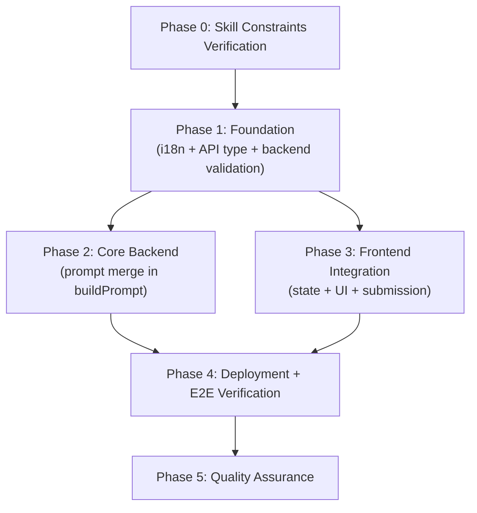
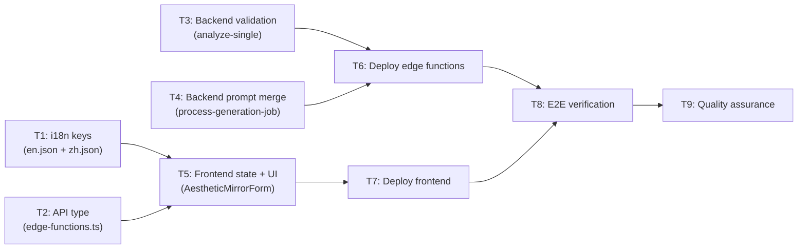

# Work Plan: Per-Reference-Image Prompts in Batch Mode

Created Date: 2026-03-02
Type: feature
Estimated Duration: 1 day
Estimated Impact: 7 files
Related Issue/PR: N/A

## Related Documents
- Design Doc: [docs/design/per-reference-prompts.md](../design/per-reference-prompts.md)
- Test Skeleton: [docs/plans/test-skeleton-per-reference-prompts.md](test-skeleton-per-reference-prompts.md)

## Objective

Enable users to provide independent supplementary prompts for each reference image in Aesthetic Mirror batch mode, improving control over per-reference output quality and style variation.

## Background

Currently, batch mode in Style Replication (Aesthetic Mirror) supports only a single global `userPrompt` that applies identically to all reference images. Users who want different instructions for different references (e.g., "warm autumn tones" for one reference, "cool blue mood" for another) have no way to express this. This feature adds per-reference prompt panels via an accordion UI and propagates those prompts through the API and backend prompt-building pipeline.

## Phase Structure



## Task Dependencies



## Risks and Countermeasures

### Technical Risks

- **Risk**: Array index misalignment between `batchUserPrompts` and `batchRefs` after add/remove operations
  - **Impact**: Wrong prompt applied to wrong reference image, silent data corruption
  - **Countermeasure**: Sync `setBatchUserPrompts` inside every `setBatchRefs` mutation. Always use index-based filter/append, never reassign independently.
  - **Detection**: Manual test -- add 3 refs, type in #2, remove #2, verify #2 text is gone and #1/#3 retain values.

- **Risk**: `buildPrompt()` receives out-of-bounds `reference_index` for `userPrompts[]`
  - **Impact**: Runtime crash or undefined behavior in worker
  - **Countermeasure**: Use optional chaining with nullish coalescing: `userPrompts[unit.reference_index]?.trim() ?? ""`. Design doc specifies this pattern.
  - **Detection**: Backward compat test -- send request without `userPrompts` field, verify identical behavior.

- **Risk**: Frontend sends `userPrompts` with wrong length (mismatched with `referenceImages`)
  - **Impact**: 400 error from backend validation
  - **Countermeasure**: Frontend only sends `userPrompts` when at least one is non-empty, and always derives from `batchUserPrompts` which is length-synced with `batchRefs`.
  - **Detection**: Backend validation rejects mismatched lengths explicitly.

### Schedule Risks

- **Risk**: No test framework installed -- cannot run automated integration tests
  - **Impact**: Test skeletons in test-skeleton document remain unexecutable
  - **Countermeasure**: Manual verification procedures defined for each phase. Automated tests deferred to framework installation milestone.

---

## Implementation Phases

### Phase 0: Confirm Skill Constraints (Estimated commits: 0)
**Purpose**: Verify all skill constraints and prerequisites before implementation begins.

#### Tasks
- [ ] Confirm Design Doc status is Proposed/Accepted and all 8 ACs are clear
- [ ] Verify `ChevronDown` icon is available from `lucide-react` (already in project)
- [ ] Verify no `@radix-ui/react-accordion` is needed (Design Doc confirms custom collapsible)
- [ ] Verify `batchRefs` state structure and `buildPrompt()` closure location match Design Doc analysis
- [ ] Confirm backward compatibility requirement: `userPrompts` optional at every layer

#### Phase Completion Criteria
- [ ] All Design Doc assumptions validated against current codebase
- [ ] No blocking prerequisites identified

---

### Phase 1: Foundation -- i18n Keys, API Type, Backend Validation (Estimated commits: 3)
**Purpose**: Add all non-UI foundation changes that have no mutual dependencies. These can be implemented in parallel.

#### Task 1.1: Add i18n keys to en.json and zh.json
**AC Coverage**: AC7 (i18n support)

- [ ] Add 3 keys under `studio.aestheticMirror` in `messages/en.json`:
  ```json
  "perRefPromptTitle": "Per-Reference Prompts",
  "perRefLabel": "#{index} {name}",
  "perRefPlaceholder": "Specific instructions for this reference image..."
  ```
- [ ] Add 3 matching keys in `messages/zh.json`:
  ```json
  "perRefPromptTitle": "单图提示词",
  "perRefLabel": "#{index} {name}",
  "perRefPlaceholder": "针对此参考图的特定指令..."
  ```
- [ ] Verify next-intl ICU syntax for `{index}` and `{name}` interpolation

**Completion Criteria**:
- Both JSON files parse without errors
- Keys are nested under `studio.aestheticMirror` namespace
- Both locales have identical key structure

#### Task 1.2: Add `userPrompts` field to `AnalyzeSingleParams` type
**AC Coverage**: AC3 (API contract)

- [ ] In `lib/api/edge-functions.ts`, add `userPrompts?: string[]` to `AnalyzeSingleParams` interface (after `userPrompt?: string`, line ~294)
- [ ] Verify TypeScript compilation passes (`npx tsc --noEmit` or IDE check)

**Completion Criteria**:
- `AnalyzeSingleParams` has `userPrompts?: string[]` field
- Existing code compiles without changes (additive-only type extension)

#### Task 1.3: Add `userPrompts` validation in analyze-single edge function
**AC Coverage**: AC3 (validation), AC8 (backward compat)

- [ ] In `supabase/functions/analyze-single/index.ts`, add validation inside the `mode === "batch"` block (after line 57, after groupCount validation):
  - If `body.userPrompts` is defined:
    - Must be an array, else return `err("BATCH_INPUT_INVALID", "userPrompts must be an array if provided")`
    - Length must equal `body.referenceImages.length`, else return `err("BATCH_INPUT_INVALID", "userPrompts length must match referenceImages length")`
    - Every element must be a string, else return `err("BATCH_INPUT_INVALID", "each userPrompts entry must be a string")`
  - If `body.userPrompts` is undefined: no error (backward compat)
- [ ] No changes to payload construction -- `body.userPrompts` flows through via existing `{ ...body }` spread (line 98-105)

**Completion Criteria**:
- Invalid `userPrompts` returns 400 with descriptive error
- Missing `userPrompts` is accepted (backward compat)
- Payload construction unchanged (verify by code inspection)

#### Phase 1 Completion Criteria
- [ ] i18n keys present in both locale files
- [ ] TypeScript type updated, compilation passes
- [ ] Backend validation added, tested with curl (see verification procedures)

#### Phase 1 Operational Verification Procedures

**1.2 Type verification**:
1. Run `npx tsc --noEmit` from project root
2. Expected: No new type errors

**1.3 Backend validation verification (curl)**:
```bash
# Test: userPrompts length mismatch -> 400
curl -X POST <SUPABASE_URL>/functions/v1/analyze-single \
  -H "Authorization: Bearer <TOKEN>" \
  -H "Content-Type: application/json" \
  -d '{"mode":"batch","referenceImages":["a","b"],"productImage":"p","userPrompts":["x"],"model":"flux-kontext-pro","aspectRatio":"1:1","imageSize":"2K","turboEnabled":false}'
# Expected: 400, BATCH_INPUT_INVALID, "userPrompts length must match referenceImages length"

# Test: No userPrompts field -> 200 (backward compat)
curl -X POST <SUPABASE_URL>/functions/v1/analyze-single \
  -H "Authorization: Bearer <TOKEN>" \
  -H "Content-Type: application/json" \
  -d '{"mode":"batch","referenceImages":["a","b"],"productImage":"p","model":"flux-kontext-pro","aspectRatio":"1:1","imageSize":"2K","turboEnabled":false}'
# Expected: 200 (or 402 insufficient credits -- either confirms validation passed)
```

---

### Phase 2: Core Backend -- Prompt Merge Logic (Estimated commits: 1)
**Purpose**: Implement the prompt merging logic in `buildPrompt()` within the worker.

#### Task 2.1: Modify process-generation-job to merge per-reference prompts
**AC Coverage**: AC4 (prompt merge -- all 4 combinations), AC8 (backward compat)

- [ ] In `supabase/functions/process-generation-job/index.ts`, after line 1135 (`const userPrompt = ...`), add extraction:
  ```typescript
  const userPrompts: string[] = Array.isArray(payload.userPrompts)
    ? (payload.userPrompts as string[]).map((s) =>
        typeof s === "string" ? s.trim() : "")
    : [];
  ```
- [ ] Modify `buildPrompt()` function (line 1271-1318):
  - Compute `perRefPrompt = userPrompts[unit.reference_index]?.trim() ?? ""`
  - Compute `mergedUserInstruction = [userPrompt, perRefPrompt].filter(Boolean).join(". ")`
  - Replace both occurrences of `if (userPrompt) parts.push(\`Additional instructions: ${userPrompt}\`)` with `if (mergedUserInstruction) parts.push(\`Additional instructions: ${mergedUserInstruction}\`)`
  - Leave the refinement mode branch unchanged (it uses `userPrompt` independently, per Design Doc non-scope)
- [ ] Verify: When `userPrompts` is empty array or absent, `perRefPrompt` is always `""`, so `mergedUserInstruction` equals `userPrompt` alone -- identical to pre-change behavior

**Completion Criteria**:
- All 4 prompt combinations produce correct output:
  - Both non-empty: `"Additional instructions: {global}. {perRef}"`
  - Global only: `"Additional instructions: {global}"`
  - Per-ref only: `"Additional instructions: {perRef}"`
  - Both empty: No "Additional instructions" appended
- Refinement mode is unchanged
- No runtime errors on undefined/empty `userPrompts`

#### Phase 2 Completion Criteria
- [ ] `buildPrompt()` correctly merges global and per-ref prompts
- [ ] Backward compatibility: absent `userPrompts` produces identical behavior to current code
- [ ] Refinement mode unaffected

#### Phase 2 Operational Verification Procedures

**Code inspection verification**:
1. Read the modified `buildPrompt()` function
2. Trace through all 4 combinations manually:
   - `userPrompt="G"`, `userPrompts=["","P",""]`, `reference_index=1` -> `"Additional instructions: G. P"`
   - `userPrompt="G"`, `userPrompts=["","",""]`, `reference_index=0` -> `"Additional instructions: G"`
   - `userPrompt=""`, `userPrompts=["","P",""]`, `reference_index=1` -> `"Additional instructions: P"`
   - `userPrompt=""`, `userPrompts=[]`, `reference_index=0` -> No "Additional instructions"
3. Verify refinement branch (line 1272-1289) is untouched

---

### Phase 3: Frontend Integration -- State, UI, and Submission (Estimated commits: 1)
**Purpose**: Add the `batchUserPrompts` state, accordion UI, array sync logic, and submission integration.

#### Task 3.1: Add state, sync logic, PerRefPromptPanel component, and submission changes
**AC Coverage**: AC1 (accordion visibility), AC2 (thumbnail/filename), AC3 (API payload), AC5 (sync), AC6 (single ref hidden)

- [ ] Add `ChevronDown` to the lucide-react import (line 21)
- [ ] Add state: `const [batchUserPrompts, setBatchUserPrompts] = useState<string[]>([])`
- [ ] Modify `addBatchRefs` (line 264) to sync `batchUserPrompts`:
  ```typescript
  const addBatchRefs = (files: FileList | null) => {
    const newFiles = Array.from(files ?? [])
      .filter((f) => f.type.startsWith('image/'))
    setBatchRefs((prev) => {
      const added = newFiles.slice(0, Math.max(0, 12 - prev.length))
        .map((file) => ({ file, previewUrl: URL.createObjectURL(file) }))
      setBatchUserPrompts((pp) => [...pp, ...added.map(() => '')])
      return [...prev, ...added]
    })
  }
  ```
- [ ] Modify batchRefs `onRemove` handler (line 336) to sync:
  ```typescript
  onRemove={() => {
    setBatchRefs((p) => p.filter((_, idx) => idx !== i))
    setBatchUserPrompts((p) => p.filter((_, idx) => idx !== i))
  }}
  ```
- [ ] Add `PerRefPromptPanel` local component (before the `AestheticMirrorForm` export):
  - Collapsible panel with thumbnail (32x32), index label, filename, ChevronDown toggle
  - Textarea for per-ref prompt (2 rows, min-h-[72px])
  - Follows project styling: rounded-xl, border-[#d0d4dc], bg-[#f7f8fa], text-[13px]
  - Uses `useTranslations('studio.aestheticMirror')` for `perRefLabel` and `perRefPlaceholder`
- [ ] Add accordion section in the prompt section (after the global prompt Textarea, around line 426):
  - Render condition: `mode === 'batch' && batchRefs.length > 1`
  - Map over `batchRefs` with `PerRefPromptPanel` for each
  - `defaultOpen={batchRefs.length === 2}` (auto-open when exactly 2 refs)
  - `disabled={isRunning}`
- [ ] Modify `handleSubmit` batch branch (line 202) to include `userPrompts`:
  ```typescript
  userPrompts: batchUserPrompts.some((p) => p.trim())
    ? batchUserPrompts.map((p) => p.trim())
    : undefined,
  ```
- [ ] Add `batchUserPrompts` to `handleSubmit` `useCallback` dependency array (line 206)

**Completion Criteria**:
- Accordion visible when `mode === 'batch' && batchRefs.length > 1`
- Accordion hidden when `batchRefs.length <= 1` or `mode === 'single'`
- Each panel shows thumbnail, `#{index} {name}`, and collapsible textarea
- Adding refs appends empty-string prompts
- Removing a ref removes the corresponding prompt (index-aligned)
- Submission includes `userPrompts` only when at least one is non-empty
- `batchUserPrompts` in dependency array prevents stale closure

#### Phase 3 Completion Criteria
- [ ] Accordion UI renders correctly in batch mode with 2+ refs
- [ ] State sync verified: add/remove refs keeps prompts aligned
- [ ] Submission payload correct (userPrompts present/absent as expected)
- [ ] i18n labels render in both English and Chinese
- [ ] No TypeScript compilation errors

#### Phase 3 Operational Verification Procedures

**Manual browser testing**:
1. Navigate to Aesthetic Mirror, switch to batch mode
2. Upload 1 reference image -- verify NO accordion panels appear (AC6)
3. Upload a 2nd reference image -- verify accordion section appears with 2 panels, both auto-expanded (AC1)
4. Verify each panel header shows thumbnail, index number, and filename (AC2)
5. Click panel header -- verify it collapses/expands
6. Type "warm autumn tones" in panel #2
7. Upload a 3rd reference image -- verify panel #3 appears with empty textarea, panel #2 retains text (AC5)
8. Remove reference image #2 -- verify "warm autumn tones" text disappears, remaining panels re-index correctly (AC5)
9. Open browser DevTools Network tab
10. Fill per-ref prompt for one panel, click Generate
11. Inspect the `analyze-single` request payload -- verify `userPrompts` array is present with correct length (AC3)
12. Clear all per-ref prompts, click Generate -- verify `userPrompts` is absent from payload
13. Switch to Chinese locale -- verify section title shows "单图提示词", placeholder shows Chinese text (AC7)

---

### Phase 4: Deployment and E2E Verification (Estimated commits: 0)
**Purpose**: Deploy all changes and verify end-to-end flow in production.

#### Task 4.1: Deploy edge functions
- [ ] Deploy analyze-single: `supabase functions deploy analyze-single --project-ref fnllaezzqarlwtyvecqn`
- [ ] Deploy process-generation-job: `supabase functions deploy process-generation-job --project-ref fnllaezzqarlwtyvecqn`
- [ ] Verify deployment success (no errors in deploy output)

#### Task 4.2: Deploy frontend
- [ ] Deploy to Vercel: `vercel --prod --yes`
- [ ] Verify deployment success and site is accessible

#### Task 4.3: End-to-end verification
- [ ] Execute the following E2E verification procedure (from Design Doc):

**E2E Verification Steps**:
1. Open Aesthetic Mirror at `https://shopix-ai.company/en/studio/aesthetic-mirror` in batch mode
2. Upload 3 reference images (e.g., spring/summer/autumn themed)
3. Enter global prompt: "Professional e-commerce style"
4. Expand accordion panel #2, enter: "warm autumn tones, golden hour lighting"
5. Leave panels #1 and #3 empty
6. Click Generate
7. **Verify**: All 3 results have professional style; result #2 has distinct warm/golden characteristics compared to #1 and #3
8. **Verify**: No errors in browser console or network failures

**Backward Compatibility Verification**:
9. Clear all per-ref prompts, submit again with only global prompt
10. **Verify**: Behavior identical to pre-feature (only global prompt applied)
11. **Verify**: No API errors, job completes successfully

#### Phase 4 Completion Criteria
- [ ] Both edge functions deployed successfully
- [ ] Frontend deployed successfully
- [ ] E2E verification passes: per-ref prompts visually affect output
- [ ] Backward compatibility confirmed: global-only prompts still work

---

### Phase 5: Quality Assurance (Required) (Estimated commits: 0)
**Purpose**: Final quality gate -- verify all acceptance criteria and code quality.

#### Tasks
- [ ] **AC1**: Accordion panels appear for >1 reference images -- VERIFIED
- [ ] **AC2**: Each panel shows thumbnail and filename -- VERIFIED
- [ ] **AC3**: Per-reference prompts sent as `userPrompts[]` -- VERIFIED
- [ ] **AC4**: Backend merges global + per-reference prompts correctly -- VERIFIED
- [ ] **AC5**: Dynamic sync on add/remove -- VERIFIED
- [ ] **AC6**: Single reference image -- no change -- VERIFIED
- [ ] **AC7**: i18n support (en + zh) -- VERIFIED
- [ ] **AC8**: Backward compatibility -- VERIFIED
- [ ] TypeScript compilation: `npx tsc --noEmit` passes
- [ ] No console errors or warnings in browser
- [ ] Build success: `npm run build` passes
- [ ] Verify skill fidelity: implementation matches Design Doc specifications exactly

#### Phase 5 Completion Criteria
- [ ] All 8 acceptance criteria verified
- [ ] Zero TypeScript errors
- [ ] Build passes
- [ ] No regressions in single mode or refinement mode

#### Operational Verification Procedures

From Design Doc E2E test strategy:
1. Upload 2 refs in batch mode -- accordion appears with 2 panels
2. Upload 1 ref in batch mode -- no accordion, only global prompt
3. Click panel header -- panel body toggles
4. Type in panel #2, add ref #3 -- panel #2 retains text, #3 is empty
5. Upload 3 refs, type in all, remove #2 -- panels #1 and #3 remain with correct text
6. Fill per-ref prompts, submit -- network request contains `userPrompts` array
7. Leave all per-ref empty, submit -- network request does not include `userPrompts`

---

## Quality Checklist

- [x] Design Doc consistency verification
- [x] Phase composition based on technical dependencies
- [x] All requirements (8 ACs) converted to tasks
- [x] Quality assurance exists in final phase
- [x] E2E verification procedures placed at integration points (Phase 4)
- [x] Test design information reflected:
  - [x] INT-3 (buildPrompt merge) covered by Phase 2 verification
  - [x] INT-2 (API payload) covered by Phase 3 verification
  - [x] INT-1 (accordion sync) covered by Phase 3 verification
  - [x] E2E-1 (full journey) covered by Phase 4 verification
  - [x] AC and test case traceability specified per task

## Test Skeleton Traceability

| Test ID | AC Coverage | Covered In Phase | Verification Method |
|---------|-------------|-----------------|---------------------|
| INT-1 (Accordion visibility + sync) | AC1, AC5, AC6 | Phase 3 | Manual browser test |
| INT-2 (API payload contract) | AC3 | Phase 3 | DevTools network inspection |
| INT-3 (buildPrompt merge) | AC4, AC8 | Phase 2 | Code trace + Phase 4 E2E |
| E2E-1 (Full batch flow) | AC1-AC8 | Phase 4 | Production E2E verification |

**Note**: No test framework is installed. Test skeletons (INT-1, INT-2, INT-3, E2E-1) are documented in `docs/plans/test-skeleton-per-reference-prompts.md` for future automation when Vitest/Playwright are adopted.

---

## Completion Criteria

- [ ] All phases completed
- [ ] Each phase's operational verification procedures executed
- [ ] Design Doc acceptance criteria satisfied (all 8 ACs)
- [ ] Edge functions deployed and operational
- [ ] Frontend deployed and accessible
- [ ] Backward compatibility confirmed
- [ ] User review approval obtained

## Progress Tracking

### Phase 0: Confirm Skill Constraints
- Start:
- Complete:
- Notes:

### Phase 1: Foundation
- Start:
- Complete:
- Notes:

### Phase 2: Core Backend
- Start:
- Complete:
- Notes:

### Phase 3: Frontend Integration
- Start:
- Complete:
- Notes:

### Phase 4: Deployment + E2E
- Start:
- Complete:
- Notes:

### Phase 5: Quality Assurance
- Start:
- Complete:
- Notes:

## Notes

- **No new npm dependencies**: Design Doc specifies custom collapsible (React state + Tailwind), no `@radix-ui/react-accordion` needed.
- **`PerRefPromptPanel` is a local component**: Defined inside `AestheticMirrorForm.tsx`, not extracted to separate file (no reuse outside this form).
- **Deployment commands**:
  - Edge functions: `supabase functions deploy <name> --project-ref fnllaezzqarlwtyvecqn`
  - Frontend: `vercel --prod --yes`
- **retryFailed callback**: Does not need changes -- it reuses the job payload already stored in the database which includes `userPrompts`.
- **Test framework**: Project has no Jest/Vitest/Playwright installed. All verification is manual for now. Test skeletons are preserved for future automation.
