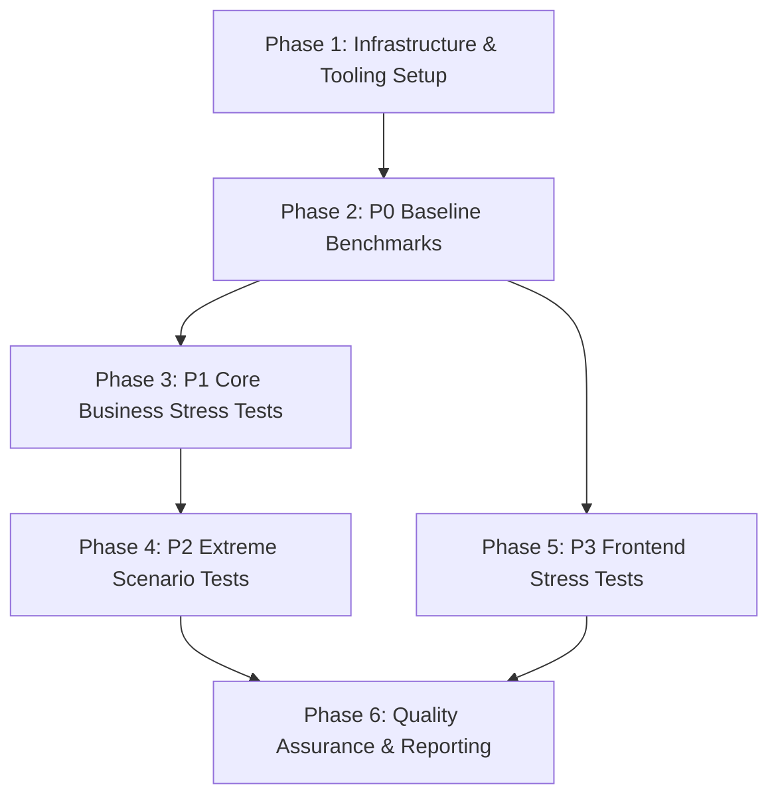
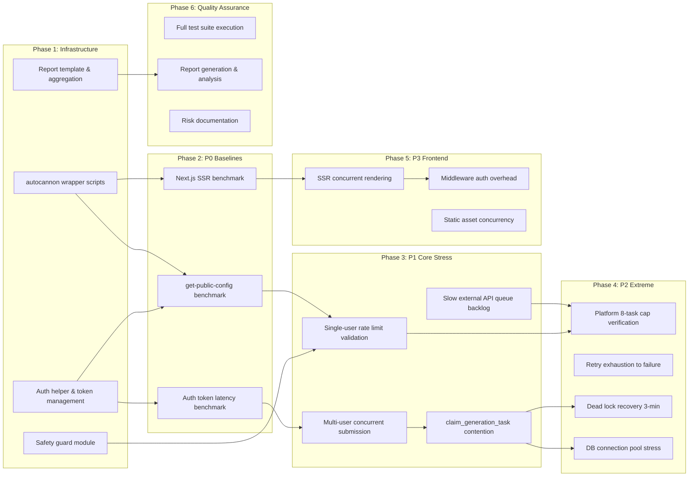

# Work Plan: Shopix Stress Test Implementation

Created Date: 2026-03-08
Type: test
Estimated Duration: 5 days
Estimated Impact: 15+ new files (test scripts, configs, report templates)

## Related Documents
- Project Memory: `.claude/MEMORY.md` (queue architecture, known issues)
- Migration references: `supabase/migrations/20260308013000_generation_queue_backpressure.sql`
- Claim function: `supabase/migrations/20260308016000_claim_generation_task_global_limit.sql`

## Objective

Establish a comprehensive stress testing suite for Shopix to:
1. Quantify baseline performance of all critical endpoints
2. Validate backpressure/rate-limiting mechanisms under load
3. Identify bottlenecks in DB connection pool, queue system, and external API integration
4. Provide repeatable, script-driven benchmarks for regression detection

## Background

Shopix is an AI-powered e-commerce product image generation SaaS. The system relies on:
- Supabase Edge Functions (Deno) as the API layer
- PostgreSQL-based task queue with `claim_generation_task()` for atomic task claiming
- External AI APIs (QN Image/Chat, OpenRouter) with 30s timeouts
- Per-user and platform-level concurrency limits (backpressure)
- Next.js 14.2 frontend with i18n middleware

Known issues include intermittent WORKER_LIMIT errors during concurrent bursts, potential DB connection pool exhaustion under heavy submission load, and middleware `getUser()` calls adding latency to every protected route request.

## Phase Structure Diagram



## Task Dependency Diagram



## Risks and Countermeasures

### Technical Risks
- **Risk**: Stress tests against production Supabase Edge Functions may trigger rate limits or degrade service
  - **Impact**: Service interruption for real users
  - **Countermeasure**: Implement safety guards: max concurrency cap (10), max duration (60s per test), abort-on-error-rate (>50% errors stops test). Run during off-peak hours (UTC 02:00-06:00, Beijing 10:00-14:00). Use `get-public-config` for initial calibration only.
  - **Detection**: Monitor Supabase dashboard during tests

- **Risk**: AI API (QN) calls consume credits and incur cost
  - **Impact**: Unexpected billing
  - **Countermeasure**: P1/P2 tests that hit generate/analyze endpoints use queue-only validation (verify 200/429 responses). Never let jobs reach worker processing with real AI calls. Use dedicated test user with minimal credits.
  - **Detection**: Pre/post credit balance check in test scripts

- **Risk**: DB connection pool exhaustion may affect production
  - **Impact**: All users lose access temporarily
  - **Countermeasure**: Limit concurrent DB-hitting tests to 5 connections max. P2 DB stress test uses controlled ramp-up with circuit breaker. Prefer read-only queries for pool testing.
  - **Detection**: Monitor pg_stat_activity during tests

- **Risk**: JWT tokens expire during long-running tests
  - **Impact**: Tests fail with auth errors, false results
  - **Countermeasure**: Token refresh logic in auth helper; use long-lived service role token where safe; pre-warm tokens before each test phase

### Schedule Risks
- **Risk**: External API variability makes tests non-deterministic
  - **Impact**: Unreliable benchmark data
  - **Countermeasure**: Run each benchmark 3 times minimum; report median values; flag outliers > 2 standard deviations

## File Structure

```
tests/stress/
  README.md                         # Usage guide
  config.ts                         # Central configuration (URLs, limits, thresholds)
  helpers/
    auth.ts                         # Token acquisition, refresh, multi-user management
    safety-guard.ts                 # Circuit breaker, abort-on-error, concurrency limits
    report.ts                       # p50/p95/p99 calculation, CSV/JSON output
    supabase-client.ts              # Service-role client for DB verification
  p0-baselines/
    bench-public-config.ts          # get-public-config benchmark
    bench-nextjs-ssr.ts             # Homepage SSR benchmark
    bench-auth-token.ts             # Token acquire/refresh latency
  p1-core-stress/
    stress-rate-limit.ts            # Single-user rapid submission
    stress-multi-user.ts            # Multi-user concurrent submission
    stress-claim-contention.ts      # claim_generation_task() race conditions
    stress-slow-api-backlog.ts      # Queue behavior with slow workers
  p2-extreme/
    extreme-platform-cap.ts         # 8-task global cap verification
    extreme-retry-exhaust.ts        # 5-attempt failure verification
    extreme-lock-recovery.ts        # 3-minute stale lock reclaim
    extreme-db-pool.ts              # Connection pool saturation
  p3-frontend/
    bench-ssr-concurrent.ts         # SSR concurrent rendering
    bench-middleware-auth.ts         # Middleware getUser() overhead
    bench-static-assets.ts          # Static asset serving
  run-all.sh                        # Orchestrator script
  reports/                          # Generated reports directory (gitignored)
    report-template.json            # Template for structured output
```

## Implementation Phases

---

### Phase 1: Infrastructure & Tooling Setup (Estimated commits: 3)

**Purpose**: Create reusable test infrastructure, safety mechanisms, and reporting templates that all subsequent phases depend on.

#### Tasks

- [ ] Task 1.1: Create `tests/stress/config.ts` -- central configuration
  - Supabase Edge Function base URL
  - Next.js app URL
  - Concurrency limits (default max 10 concurrent connections)
  - Duration limits (default max 60s per benchmark)
  - Error rate circuit breaker threshold (50%)
  - Endpoint paths for all targets
  - Pass/fail thresholds per test (p95 latency, error rate, throughput)

- [ ] Task 1.2: Create `tests/stress/helpers/auth.ts` -- token management
  - `acquireToken(email, password)`: obtain JWT via Supabase Auth `signInWithPassword`
  - `refreshToken(refreshToken)`: refresh expired JWT
  - `acquireMultipleTokens(count)`: pre-provision N test user tokens
  - Token caching with TTL-aware refresh
  - Environment variable support: `STRESS_TEST_EMAIL`, `STRESS_TEST_PASSWORD`
  - Multi-user support: `STRESS_TEST_EMAIL_2`, etc., or auto-generate from pattern

- [ ] Task 1.3: Create `tests/stress/helpers/safety-guard.ts` -- circuit breaker
  - `SafetyGuard` class with:
    - Max concurrency enforcement (configurable, default 10)
    - Error rate tracking with sliding window
    - Auto-abort when error rate exceeds threshold
    - Cooldown period between test phases (5s default)
    - Test duration hard limit enforcement
  - Integration with autocannon `setupClient` / `onResponse` hooks

- [ ] Task 1.4: Create `tests/stress/helpers/report.ts` -- result aggregation
  - Parse autocannon JSON output
  - Calculate p50, p95, p99 latencies
  - Calculate throughput (req/s), error rates by status code
  - Generate structured JSON report matching template
  - Generate human-readable summary to stdout
  - CSV export for spreadsheet analysis
  - Comparison mode: diff two report files

- [ ] Task 1.5: Create `tests/stress/helpers/supabase-client.ts` -- DB verification helper
  - Service-role Supabase client for post-test assertions
  - Query `generation_jobs` / `generation_job_tasks` state
  - Query `pg_stat_activity` for connection monitoring
  - Cleanup helper: mark test-created jobs as failed

- [ ] Task 1.6: Create `tests/stress/reports/report-template.json`
  - Template structure for consistent reporting

- [ ] Quality check: All helpers export correct TypeScript types; `npx tsx tests/stress/helpers/auth.ts --help` runs without error

#### Phase Completion Criteria
- [ ] All helper modules importable and type-correct
- [ ] Safety guard unit-tested with mock autocannon results
- [ ] Report generator produces valid JSON from sample autocannon output
- [ ] Auth helper can acquire at least 1 valid JWT token

#### Operational Verification Procedures
1. Run `npx tsx tests/stress/helpers/auth.ts` to verify token acquisition
2. Run `npx tsx tests/stress/helpers/report.ts --sample` to verify report generation from sample data
3. Verify safety guard abort logic with a mock 100% error scenario

---

### Phase 2: P0 Baseline Benchmarks (Estimated commits: 2)

**Purpose**: Establish performance baselines for the simplest endpoints to calibrate tooling and set reference points.

#### Tasks

- [ ] Task 2.1: `bench-public-config.ts` -- `get-public-config` endpoint benchmark
  - **Target**: `POST /functions/v1/get-public-config` with valid Bearer token
  - **Method**: autocannon, 10 connections, 30s duration
  - **Metrics**: p50/p95/p99 latency, throughput, error rate
  - **Pass criteria**: p95 < 500ms, error rate < 1%, throughput > 20 req/s
  - **Note**: This endpoint requires auth (calls `requireUser`), so tokens are needed
  - **Safety**: Read-only, no state mutation

- [ ] Task 2.2: `bench-nextjs-ssr.ts` -- Next.js homepage SSR benchmark
  - **Target**: `GET /` (follows redirect to `GET /en` or `GET /zh`)
  - **Method**: autocannon, 10 connections, 30s duration
  - **Metrics**: p50/p95/p99 latency, throughput
  - **Pass criteria**: p95 < 2000ms, error rate < 1%
  - **Note**: No auth required for public pages; middleware runs i18n detection
  - **Safety**: Read-only

- [ ] Task 2.3: `bench-auth-token.ts` -- Supabase Auth token acquisition latency
  - **Target**: `POST /auth/v1/token?grant_type=password` on Supabase
  - **Method**: Sequential requests (NOT parallel -- avoid account lockout), 20 iterations
  - **Metrics**: p50/p95/p99 latency for token acquisition
  - **Pass criteria**: p95 < 1000ms
  - **Safety**: Low volume, sequential only; abort if any 429 received

- [ ] Quality check: All benchmarks produce valid JSON reports; pass/fail criteria evaluated

#### Phase Completion Criteria
- [ ] Three baseline benchmarks executed successfully at least once
- [ ] Results saved to `tests/stress/reports/` as JSON files
- [ ] Baseline numbers documented for future comparison
- [ ] No errors > 5% on any baseline test

#### Operational Verification Procedures
1. Execute: `npx tsx tests/stress/p0-baselines/bench-public-config.ts`
2. Verify JSON report generated at `tests/stress/reports/p0-public-config-YYYYMMDD.json`
3. Verify p95 latency value exists and is a positive number
4. Check Supabase dashboard -- no anomalies during test window

---

### Phase 3: P1 Core Business Path Stress Tests (Estimated commits: 3)

**Purpose**: Validate that backpressure mechanisms, rate limiting, and queue contention work correctly under realistic concurrent load.

#### Tasks

- [ ] Task 3.1: `stress-rate-limit.ts` -- Single-user rapid submission, verify 429 triggers
  - **Target**: `POST /functions/v1/generate-image` with valid payload
  - **Method**:
    1. Submit IMAGE_GEN jobs rapidly from single user (10 requests in < 2s)
    2. Expect: first 8 return 200 (limit=8), subsequent return 429 `TOO_MANY_ACTIVE_JOBS`
    3. Verify 429 response contains `active`, `limit`, `type` fields
  - **Pass criteria**: 429 triggered before 9th concurrent job; response body matches expected schema
  - **Cleanup**: Mark all test jobs as failed via service-role client after test
  - **Safety**: Jobs enqueued but worker NOT invoked (no AI API cost). Cleanup immediately.
  - **Detailed verification**:
    - Also test ANALYSIS limit (4) and STYLE_REPLICATE limit (4)
    - Verify `detect-image-text` rate limit at 20 req/hour boundary

- [ ] Task 3.2: `stress-multi-user.ts` -- Multi-user concurrent submission
  - **Target**: `POST /functions/v1/generate-image` with 5 different user tokens
  - **Method**:
    1. Each user submits 4 IMAGE_GEN jobs concurrently (20 total jobs)
    2. Verify per-user limits independent (each user can submit up to 8)
    3. Verify platform-level cap (8 max running tasks via `claim_generation_task`)
    4. Measure queue depth and submission latency
  - **Pass criteria**: No user incorrectly blocked below their limit; platform cap enforced at claim time
  - **Cleanup**: All test jobs marked failed after test
  - **Safety**: Queue-only, no worker invocation

- [ ] Task 3.3: `stress-claim-contention.ts` -- `claim_generation_task()` race condition test
  - **Target**: Direct Supabase RPC call to `claim_generation_task`
  - **Method**:
    1. Create 10 queued tasks in `generation_job_tasks`
    2. Call `claim_generation_task` concurrently from 10 connections
    3. Verify: at most 8 tasks enter `running` (platform cap)
    4. Verify: no double-claim (each task claimed by exactly one worker)
    5. Verify: attempts incremented exactly once per claim
  - **Pass criteria**: Zero double-claims; running count <= max_running; all claims atomic
  - **Cleanup**: Delete test tasks and jobs
  - **Safety**: Uses service-role key; creates/deletes test data only

- [ ] Task 3.4: `stress-slow-api-backlog.ts` -- Queue behavior with slow worker responses
  - **Target**: Simulate slow AI API by observing queue state over time
  - **Method**:
    1. Create 12 queued tasks
    2. Invoke `drain-generation-queue` to claim batch
    3. Monitor queue state: `running` tasks should not exceed 8
    4. Wait 3+ minutes, verify stale `running` tasks become re-claimable
    5. Invoke `drain-generation-queue` again, verify stale tasks reclaimed
  - **Pass criteria**: Queue never exceeds platform cap; stale recovery works after 3 minutes
  - **Cleanup**: All test tasks cleaned up
  - **Safety**: Worker invocation will hit real process-generation-job but tasks will likely fail quickly (no valid payload); monitor carefully

- [ ] Quality check: All stress tests produce structured reports; cleanup verified via DB queries

#### Phase Completion Criteria
- [ ] All 4 stress tests execute without tooling errors
- [ ] Rate limiting (429) triggers correctly for all 3 job types
- [ ] `claim_generation_task` shows zero double-claims under contention
- [ ] Queue backlog behavior documented with timing data
- [ ] All test data cleaned up (zero orphan test jobs remaining)

#### Operational Verification Procedures
1. Before each test: query `SELECT count(*) FROM generation_job_tasks WHERE status='running'` to baseline
2. After rate-limit test: verify 429 count matches expected (`total_requests - per_user_limit`)
3. After contention test: `SELECT id, attempts, status FROM generation_job_tasks WHERE job_id IN (test_jobs)` -- verify no duplicate running
4. After all P1 tests: `SELECT count(*) FROM generation_jobs WHERE user_id = test_user_id AND status='processing'` returns 0

---

### Phase 4: P2 Extreme Scenario Tests (Estimated commits: 2)

**Purpose**: Validate system behavior at operational boundaries -- retry exhaustion, lock recovery, and connection pool limits.

#### Tasks

- [ ] Task 4.1: `extreme-platform-cap.ts` -- 8-task global cap boundary test
  - **Target**: `claim_generation_task()` via RPC
  - **Method**:
    1. Create exactly 9 queued tasks across different users
    2. Claim tasks sequentially: first 8 succeed, 9th returns NULL
    3. Complete one task (set to `success`), claim 9th: should succeed
    4. Verify count transitions: 8 -> 7 -> 8
  - **Pass criteria**: Cap honored at exactly `generation_queue_max_running_tasks` value; freed slot reusable immediately
  - **Safety**: Direct DB operations via service-role

- [ ] Task 4.2: `extreme-retry-exhaust.ts` -- 5-attempt failure cascade
  - **Target**: `claim_generation_task()` via RPC
  - **Method**:
    1. Create a task with `attempts = 4` (one retry left)
    2. Claim: should succeed (attempts becomes 5)
    3. Set task back to `queued` (simulating failure recovery)
    4. Claim again: should return NULL and task status should be `failed`
    5. Verify parent `generation_jobs` status becomes `failed` with error_code `MAX_ATTEMPTS_EXCEEDED`
  - **Pass criteria**: Task correctly transitions to `failed` at attempt 5; parent job fails; no further claims possible
  - **Safety**: Direct DB operations

- [ ] Task 4.3: `extreme-lock-recovery.ts` -- 3-minute stale lock reclaim
  - **Target**: `claim_generation_task()` via RPC
  - **Method**:
    1. Create a task, claim it (status=`running`, locked_at=now)
    2. Immediately try to re-claim: should return NULL (lock fresh)
    3. Update `locked_at` to `now() - interval '3 minutes 1 second'`
    4. Re-claim: should succeed (stale lock reclaimed)
    5. Verify attempts incremented (was 1, now 2)
  - **Pass criteria**: Fresh locks cannot be stolen; stale locks (>3 min) reclaimed; attempts correctly tracked
  - **Safety**: Direct DB operations, time manipulation via SQL UPDATE

- [ ] Task 4.4: `extreme-db-pool.ts` -- Connection pool saturation probe
  - **Target**: Multiple concurrent Supabase client connections
  - **Method**:
    1. Create 20 concurrent Supabase service-role clients
    2. Each executes a `SELECT pg_sleep(0.5)` query simultaneously
    3. Measure: how many succeed vs timeout
    4. Ramp up: 30, 40, 50 concurrent connections
    5. Record saturation point where errors begin
  - **Pass criteria**: Document exact saturation threshold; verify graceful error handling (not crashes)
  - **Safety**: Uses `pg_sleep(0.5)` -- very short hold time; circuit breaker aborts if > 30% errors
  - **Risk**: This test can impact production DB connections -- run with extreme caution, off-peak only

- [ ] Quality check: All extreme tests report pass/fail; DB state fully cleaned up

#### Phase Completion Criteria
- [ ] Platform cap enforced exactly at configured value
- [ ] Retry exhaustion cascade verified (task -> failed, job -> failed)
- [ ] Stale lock recovery timing validated (3-minute threshold)
- [ ] DB connection pool saturation threshold documented
- [ ] Zero residual test data in production tables

#### Operational Verification Procedures
1. Cap test: `SELECT count(*) FROM generation_job_tasks WHERE status='running'` never exceeds 8
2. Retry test: `SELECT status, attempts, last_error FROM generation_job_tasks WHERE id = test_task` shows `failed, 5, MAX_ATTEMPTS_EXCEEDED`
3. Lock test: timestamp comparison confirms 3-minute boundary is precise
4. Pool test: `SELECT count(*) FROM pg_stat_activity WHERE state='active'` peak recorded

---

### Phase 5: P3 Frontend Stress Tests (Estimated commits: 2)

**Purpose**: Measure Next.js frontend performance under concurrent load, isolate middleware overhead, and verify static asset serving.

#### Tasks

- [ ] Task 5.1: `bench-ssr-concurrent.ts` -- SSR concurrent rendering
  - **Target**: Multiple Next.js pages
    - `GET /en` (homepage, public)
    - `GET /en/studio-genesis` (protected, requires auth cookie)
    - `GET /en/auth` (auth page, public)
  - **Method**: autocannon, 20 connections, 30s per page
  - **Metrics**: p50/p95/p99 latency per page, throughput
  - **Pass criteria**: Public pages p95 < 3000ms; protected pages p95 < 4000ms
  - **Note**: Protected pages require valid Supabase session cookie, not just Bearer token
  - **Safety**: Read-only SSR, no mutations

- [ ] Task 5.2: `bench-middleware-auth.ts` -- Middleware auth overhead isolation
  - **Target**: Compare protected vs unprotected routes
  - **Method**:
    1. Benchmark `GET /en` (unprotected, no getUser call) -- 20 connections, 30s
    2. Benchmark `GET /en/studio-genesis` (protected, calls getUser) -- 20 connections, 30s
    3. Calculate delta: `protected_p95 - unprotected_p95 = middleware_auth_overhead`
  - **Pass criteria**: Auth overhead < 500ms per request; document actual overhead
  - **Note**: Middleware only calls `getUser()` for PROTECTED_PATHS
  - **Safety**: Read-only

- [ ] Task 5.3: `bench-static-assets.ts` -- Static asset serving benchmark
  - **Target**: `GET /_next/static/...` assets (JS bundles, CSS)
  - **Method**:
    1. Discover asset URLs from homepage HTML response
    2. autocannon, 50 connections, 15s per asset type
  - **Pass criteria**: p95 < 200ms for cached assets; zero errors
  - **Safety**: Read-only, CDN/edge-cached

- [ ] Quality check: All frontend benchmarks produce structured reports

#### Phase Completion Criteria
- [ ] SSR latency baselines established for 3+ pages
- [ ] Middleware auth overhead quantified and documented
- [ ] Static asset serving confirmed performant under load
- [ ] All results in structured JSON reports

#### Operational Verification Procedures
1. SSR test: visually confirm page content in sampled response bodies (not error pages)
2. Auth overhead: verify delta calculation is positive (protected is slower)
3. Static assets: verify HTTP 200 with correct Content-Type headers

---

### Final Phase: Quality Assurance & Reporting (Estimated commits: 1)

**Purpose**: Aggregate all test results, generate comprehensive report, document findings and recommendations.

#### Tasks

- [ ] Task 6.1: Create `tests/stress/run-all.sh` -- orchestrator script
  - Sequential execution of all test phases with cooldown between phases
  - Safety guard integration: abort if any phase shows > 50% error rate
  - Timestamp-tagged report output directory
  - Summary output: pass/fail per test, total duration

- [ ] Task 6.2: Execute full test suite via `run-all.sh`
  - Run during off-peak hours
  - Capture all reports
  - Monitor Supabase dashboard during execution

- [ ] Task 6.3: Generate comprehensive report
  - Aggregate all phase reports into single summary
  - Baseline metrics table (all p50/p95/p99 values)
  - Backpressure validation results (pass/fail per mechanism)
  - Bottleneck identification and recommendations
  - Risk assessment: which tests impacted production and severity
  - Comparison with expected thresholds

- [ ] Task 6.4: Post-test cleanup verification
  - Query `generation_jobs` for any orphaned test data
  - Query `generation_job_tasks` for any stuck test tasks
  - Verify no test data leaked to user-facing queries
  - Document cleanup actions taken

- [ ] Quality check: All tests documented, all reports generated, all cleanup verified

#### Phase Completion Criteria
- [ ] Full test suite executed at least once
- [ ] Comprehensive report generated with all metrics
- [ ] Zero orphaned test data in production
- [ ] All pass/fail criteria evaluated and documented
- [ ] Recommendations prioritized by impact

#### Operational Verification Procedures
1. `run-all.sh` exits with code 0
2. Report directory contains JSON files for each test phase
3. `SELECT count(*) FROM generation_jobs WHERE user_id IN (test_user_ids) AND status='processing'` returns 0
4. Supabase dashboard shows normal operation post-test

---

## Test Report Template

Each test produces a JSON report with this structure:

```json
{
  "test_name": "bench-public-config",
  "timestamp": "2026-03-08T10:00:00Z",
  "duration_seconds": 30,
  "connections": 10,
  "target_url": "https://fnllaezzqarlwtyvecqn.supabase.co/functions/v1/get-public-config",
  "results": {
    "total_requests": 1500,
    "throughput_rps": 50.0,
    "latency": {
      "p50_ms": 120,
      "p95_ms": 350,
      "p99_ms": 800,
      "avg_ms": 180,
      "max_ms": 1200
    },
    "status_codes": {
      "200": 1495,
      "429": 3,
      "500": 2
    },
    "error_rate_percent": 0.33
  },
  "thresholds": {
    "p95_max_ms": 500,
    "error_rate_max_percent": 1.0,
    "throughput_min_rps": 20
  },
  "pass": true,
  "notes": ""
}
```

## Summary of Pass/Fail Thresholds

| Test | Metric | Threshold | Rationale |
|------|--------|-----------|-----------|
| P0: get-public-config | p95 latency | < 500ms | Simple DB read + auth |
| P0: Next.js SSR | p95 latency | < 2000ms | SSR with i18n middleware |
| P0: Auth token | p95 latency | < 1000ms | Supabase Auth API |
| P1: Rate limit | 429 trigger | At limit+1 | Backpressure correctness |
| P1: Multi-user | No false-block | 0 false 429s | Isolation correctness |
| P1: Claim contention | Double-claims | 0 | Atomicity correctness |
| P1: Slow API backlog | Running count | <= max_running | Queue integrity |
| P2: Platform cap | Cap boundary | Exact match | Configuration correctness |
| P2: Retry exhaust | Failure at attempt 5 | Exact match | Retry logic correctness |
| P2: Lock recovery | Reclaim at 3 min | +/- 5s tolerance | Timing correctness |
| P2: DB pool | Saturation point | Documented | Capacity planning |
| P3: SSR concurrent | p95 latency | < 3000ms (public) | User experience |
| P3: Auth overhead | Delta latency | < 500ms | Middleware efficiency |
| P3: Static assets | p95 latency | < 200ms | CDN performance |

## Safety Classification

### Safe to Test Against Production

| Endpoint/Operation | Risk Level | Reason |
|---------------------|-----------|--------|
| `get-public-config` | LOW | Read-only, no side effects |
| Next.js SSR pages | LOW | Read-only rendering |
| Static assets | LOW | CDN-served, no backend impact |
| Auth token acquisition | LOW | Sequential, low volume |
| `generate-image` (queue only) | MEDIUM | Creates DB rows, needs cleanup |
| `analyze-product-v2` (queue only) | MEDIUM | Creates DB rows, needs cleanup |
| `claim_generation_task` RPC | MEDIUM | Mutates task state, needs cleanup |

### Requires Extreme Caution / Off-Peak Only

| Endpoint/Operation | Risk Level | Reason |
|---------------------|-----------|--------|
| `drain-generation-queue` | HIGH | Invokes real workers, may trigger AI API calls |
| DB connection pool saturation | HIGH | Can deny service to all users |
| Multi-user concurrent submission | MEDIUM-HIGH | May trigger platform-wide backpressure |

### Must NOT Test Against Production

| Endpoint/Operation | Risk Level | Reason |
|---------------------|-----------|--------|
| `process-generation-job` (full cycle) | CRITICAL | Calls external AI APIs, consumes credits |
| Stripe endpoints | CRITICAL | Financial operations |

## Environment Variables Required

```bash
# Required for all tests
STRESS_TEST_SUPABASE_URL=https://fnllaezzqarlwtyvecqn.supabase.co
STRESS_TEST_SUPABASE_ANON_KEY=<anon-key>
STRESS_TEST_SUPABASE_SERVICE_ROLE_KEY=<service-role-key>

# Required for authenticated tests
STRESS_TEST_EMAIL=test-stress@example.com
STRESS_TEST_PASSWORD=<password>

# Optional: additional test users for multi-user tests
STRESS_TEST_EMAIL_2=test-stress-2@example.com
STRESS_TEST_PASSWORD_2=<password>
# ... up to _10

# Required for frontend tests
STRESS_TEST_NEXTJS_URL=https://shopix-ai.vercel.app

# Optional: safety overrides
STRESS_MAX_CONCURRENCY=10          # Default: 10
STRESS_MAX_DURATION_SEC=60         # Default: 60
STRESS_ERROR_ABORT_THRESHOLD=0.5   # Default: 50%
```

## Completion Criteria
- [ ] All phases completed
- [ ] Each phase's operational verification procedures executed
- [ ] All P0 baselines established with documented values
- [ ] All P1 backpressure mechanisms validated (429 triggers, queue limits)
- [ ] All P2 extreme scenarios verified (retry, lock recovery, cap)
- [ ] P3 frontend baselines established
- [ ] Comprehensive report generated
- [ ] Zero residual test data in production
- [ ] Safety classification reviewed and honored
- [ ] All test scripts are executable and documented

## Progress Tracking

### Phase 1: Infrastructure & Tooling Setup
- Start:
- Complete:
- Notes:

### Phase 2: P0 Baseline Benchmarks
- Start:
- Complete:
- Notes:

### Phase 3: P1 Core Business Path Stress Tests
- Start:
- Complete:
- Notes:

### Phase 4: P2 Extreme Scenario Tests
- Start:
- Complete:
- Notes:

### Phase 5: P3 Frontend Stress Tests
- Start:
- Complete:
- Notes:

### Final Phase: Quality Assurance & Reporting
- Start:
- Complete:
- Notes:

## Notes

1. **get-public-config requires auth**: Despite its name suggesting public access, the endpoint calls `requireUser(req)` and requires a valid Bearer token. Tests must provide authentication.

2. **Queue-only testing strategy**: For P1 tests involving `generate-image`, `analyze-product-v2`, and `analyze-single`, we test only the queue submission path (HTTP 200 response with `job_id`). We do NOT invoke `drain-generation-queue` or `process-generation-job` for these tests to avoid AI API costs. Test data cleanup removes jobs before any worker processes them.

3. **detect-image-text in-memory rate limit**: The 20 req/hour rate limit in `detect-image-text` is per-worker-instance using `Map`. In a multi-instance Supabase Edge Function deployment, the effective limit per user may be higher. Testing this accurately requires understanding the deployment topology.

4. **claim_generation_task global limit**: As of migration `20260308016000`, the claim function checks `v_max_running` from `system_config` (key: `generation_queue_max_running_tasks`, default 8). This is a platform-wide limit, not per-user. Tests must account for any existing running tasks in production when validating the cap.

5. **Middleware optimization insight**: The middleware only calls `supabase.auth.getUser()` for paths matching `PROTECTED_PATHS`. Public pages like `/`, `/auth`, `/pricing` skip the auth check entirely. This is already an optimization worth validating under load.

6. **Test user preparation**: Create dedicated test users before running stress tests. Do NOT use admin emails (951454612@qq.com, 1027588424@qq.com) as they have special privileges (e.g., access to `ta-` models) that would skew results.
